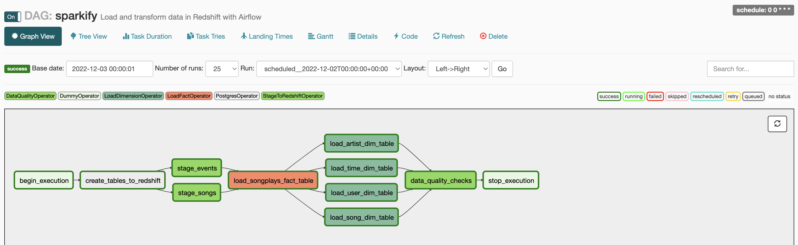

# Udacity Project: Data Pipeline with Airflow
In this project, we'll use Python and SQL to create an end-to-end data pipeline in Airflow, to

1. parse JSON logs from files store in S3
2. transform the datasets to create fact and dimension tables in Amazon Redshift
3. validate the tables in Amazon Redshift

## Overview
The goal of this project is to build an ETL for songs and user activity on a fictional music streaming app, for analytics purposes on Airflow.

## Prerequisites
* Create an IAM User in AWS.
* Create a Amazon Redshift cluster in AWS.
* Create an Amazon Web Service connection on Airflow.
* Create a Postgress connection to the Amazon Redshift Cluster on Airflow, named `redshift`.

## Available Files
The project contains several files and folders, listed bellow

.  
├── README.md  
├── dags  
│   ├── resources  
│   │   └── create_tables.sql  
│   └── sparkify_dag.py  
└── plugins  
    ├── \__init__.py  
    ├── helpers  
    │   ├── \__init__.py  
    │   └── sql_queries.py  
    └── operators  
        ├── \__init__.py  
        ├── data_quality.py  
        ├── load_dimension.py  
        ├── load_fact.py  
        └── stage_redshift.py  

Main DAG file, 
- [sparkify_dag.py](https://github.com/dsavg/udacity_data_pipelines_with_airflow/blob/main/dags/udac_example_dag.py) include DAG python code

Operators developed defined in files, 
- [data_quality.py](https://github.com/dsavg/udacity_data_pipelines_with_airflow/blob/main/plugins/operators/data_quality.py) includes data quality operator, named `DataQualityOperator`.
- [load_dimension.py](https://github.com/dsavg/udacity_data_pipelines_with_airflow/blob/main/plugins/operators/load_dimension.py) includes load dimension table operator, named `LoadDimensionOperator`.
- [load_fact.py](https://github.com/dsavg/udacity_data_pipelines_with_airflow/blob/main/plugins/operators/load_fact.py) includes load fact table operator, named `LoadFactOperator`.
- [stage_redshift.py](https://github.com/dsavg/udacity_data_pipelines_with_airflow/blob/main/plugins/operators/stage_redshift.py) includes operator to load any JSON formatted files from S3 to Amazon Redshift, named `StageToRedshiftOperator`.

Additional files, 
- [create_tables.sql](https://github.com/dsavg/udacity_data_pipelines_with_airflow/blob/main/dags/resources/create_tables.sql) includes create table queries for tables.
- [sql_queries.py](https://github.com/dsavg/udacity_data_pipelines_with_airflow/blob/main/plugins/helpers/sql_queries.py) includes sql queries to insert data to corresponding tables.

## Datasets
For this project, we will be using data from the following s3 paths
* Log data: `s3://udacity-dend/log_data`
* Song data: `s3://udacity-dend/song_data`

## DAG Overview by Task

* `begin_execution`: dummy task to indicate the start of the DAG, uses `DummyOperator` operator.
* `create_tables_to_redshift`: task uses `PostgresOperator` operator to execute the queries in [create_tables.sql](https://github.com/dsavg/udacity_data_pipelines_with_airflow/blob/main/dags/resources/create_tables.sql) and create all the tables in the database, if they don't already exist.
* `stage_events`: task uses `StageToRedshiftOperator` custom operator to read log data from S3 and load them into Amazon Redshift in `public.staging_events`.  
* `stage_songs`: task uses `StageToRedshiftOperator` custom operator to read songs data from S3 and load them into Amazon Redshift in `public.staging_songs`.  
* `load_songplays_fact_table`:  task uses `LoadFactOperator` operator, to overwite data in `public.songplays`.
* `load_user_dim_table`:  task uses `LoadDimensionOperator` operator, to overwite data in `public.users`.
* `load_song_dim_table`:  task uses `LoadDimensionOperator` operator, to overwite data in `public.songs`.
* `load_artist_dim_table`: task uses `LoadDimensionOperator` operator, to overwite data in `public.artists`. 
* `load_time_dim_table`: task uses `LoadDimensionOperator` operator, to overwite data in `public.time`.
* `data_quality_checks`: task uses `DataQualityOperator` operator, to check if tables created have any Null records for their primary key fields.
* `stop_execution`: dummy task to indicate the start of the DAG, uses `DummyOperator` operator.
